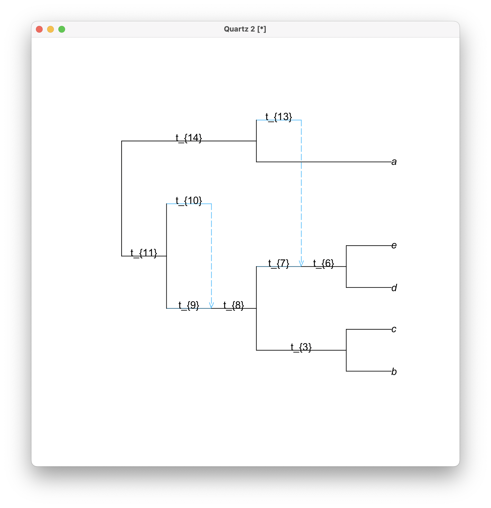

# SymbolicQuartetNetworkCoal.jl

See this [`Wiki`](https://github.com/sungsik-kong/SymbolicQuartetNetworkCoal.jl/wiki) page for detailed information on `SymbolicQuartetNetworkCoal.jl`.

<!--Aloha!

`SymbolicQuartetNetworkCoal.jl` or simply "SymCF" is a Julia package that provides useful functions for studying mathematical identifiability of phylogenetic tree and network parameters using quartet concordance factors with techniques from algebraic statistics. This package is constructed by extending another Julia package `QuartetNetworkGoodnessFit` (available at https://github.com/JuliaPhylo/QuartetNetworkGoodnessFit.jl).-->

## Installation

<!--Install with the Julia package manager [Pkg](https://pkgdocs.julialang.org/), just like any other registered Julia package (**Below will be on once the package is registered. If you see this, then it is not registered yet.**):
```@julia
pkg> add SymbolicQuartetNetworkCoal  # Press ']' to enter the Pkg REPL mode.
```
or-->


```@julia
julia> using Pkg; Pkg.add("SymbolicQuartetNetworkCoal")
```
<!--To make sure the package is installed correctly, try the following:
```@julia
julia> using SymbolicQuartetNetworkCoal

julia> aloha()
⠀⠀⠀⠀⠀⠀⠀⠀⠀⠀⠀⠀⠀⠀⠀⠀⠀⠀⠀⣀⣠⣤⣴⠂⢀⡀⠀⢀⣤⣀⠀⠀⠀⠀⠀⠀⠀⠀⠀⠀⠀⠀⠀⠀⠀⠀
⠀⠀⠀⠀⠀⠀⠀⠀⠀⠀⠀⠀⣤⣤⣄⣠⣀⠀⠘⠋⠉⠉⠁⠀⠺⣿⡷⣿⣿⣿⡿⠀⢀⡀⠀⠀⠀⠀⠀⠀⠀⠀⠀⠀⠀⠀
⠀⠀⠀⠀⠀⠀⠀⠀⠀⠀⠀⣠⣿⣿⣛⠛⠉⠀⠀⠀⠀⠺⣷⣦⠀⠀⠀⠙⠛⠉⠀⠀⠈⣿⣦⣤⣄⠀⠀⠀⠀⠀⠀⠀⠀⠀
⠀⠀⠀⠀⠀⠀⠀⢀⣴⣿⣆⠀⠈⠉⠁⠀⠀⠀⠀⠀⠀⠀⠙⠉⠀⠀⢸⣦⠀⠀⠀⢀⣼⣿⣿⣿⣿⣷⡄⠀⠀⠀⠀⠀⠀⠀
⠀⠀⠀⠀⠀⠀⠀⢺⣿⣿⡿⠁⠀⠀⠀ ⠀⠀⠀⠀⠀⠀  ⠀⠀⠀⠀⠀⠀⠀⠀⢻⣿⣿⣿⣿⣿⣿⣧⡀⠀⠀⠀⠀⠀⠀
⠀⠀⠀⠀⠀⢀⡆⠈⠁⠀⠀⠀⠀⠀⠀⠀⠀⠀⠀⢀⣠⣤⣤⣀⠀⠀⠀⠀⠀⠀⠀⠘⣿⣿⣿⣿⣿⣿⣿⣷⠄⠀⠀⠀⠀⠀
⢠⣾⣷⣦⡀⠘⠇⠀⠀⠀⠀⠀⠀⠀⠀⠀⠀⠀⣰⣿⣿⣿⣿⣿⣷⣦⡀⠀⠀⠀⠀⢠⣿⣿⣿⡿⠟⠛⠋⠁⣀⣠⣤⣄⣀⠀
⠘⣿⣿⣿⣷⣄⠀⠀⠀⠀⠀⠀⠀⠀⢠⣴⣾⣶⣿⣿⣿⣿⣿⣿⣟⠘⣿⣷⡀⠀⠀⠘⠿⡿⠉⠀⠀⣀⣴⣾⣿⣿⣿⣿⡿⡂
⠀⠈⠿⢟⣿⣿⣆⠀⠀⠀⠀⢀⣤⣤⣿⣿⣿⣿⣿⣎⠛⢫⣿⣿⣿⣷⡘⢿⣿⣆⠀⠀⠀⠀⠀⢀⣾⣿⣿⣿⣿⣿⡿⠛⠋⠁
⠀⠀⠀⢺⣿⣿⣿⣷⡄⠀⢰⣿⣿⣿⣯⠹⣿⣿⣿⣷⣶⡜⢿⣿⣿⣿⣷⡄⠹⣿⣷⣄⠀⠀⣴⣼⣿⣿⣿⣿⠟⠉⠀⠀⠀⠀
⠀⠀⠀⠀⠙⢻⣿⣿⣿⣦⡘⢿⣿⣿⣿⣃⠉⢿⣿⣿⣿⣿⡌⢻⣝⠻⠿⢃⡀⣿⣿⣿⣷⣶⣿⣿⣿⣿⡿⠃⠀⠀⠀⠀⠀⠀
⠀⠀⠀⠀⠀⠀⢻⣿⣿⣿⣷⣄⠛⣿⣿⣿⣿⣄⠻⣿⣿⣿⣿⡆⠙⠷⠶⠟⢠⣿⣿⣿⣿⣿⣿⣿⣿⡟⠁⠀⠀⠀⠀⠀⠀⠀
⠀⠀⠀⠀⠀⠀⠀⠙⢿⣿⣿⣿⡇⠈⠻⣿⣿⣿⣷⠘⠧⣉⣁⡴⠀⢠⣤⣶⣿⣿⣿⣿⣿⣿⣿⣿⡟⠀⠀⠀⠀⠀⠀⠀⠀⠀
⠀⠀⠀⠀⠀⠀⠀⠀⠈⢿⣿⣿⣿⣷⣄⠙⠧⣍⣩⡜⢀⣀⣀⠄⣴⣿⣿⣿⣿⣿⣿⣿⣿⣿⣿⠏⠀⠀⠀⠀⠀⠀⠀⠀⠀⠀
⠀⠀⠀⠀⠀⠀⠀⠀⠀⠈⢿⣿⣿⣿⣿⣷⣦⣄⣀⣤⣾⣿⣿⣼⣿⣿⣿⣿⣿⣿⣿⣿⣿⣿⠏⠀⠀⠀⠀⠀⠀⠀⠀⠀⠀⠀
⠀⠀⠀⠀⠀⠀⠀⠀⠀⠀⠀⠻⣿⣿⣿⣿⣿⣿⣿⣿⣿⣿⣿⣿⣿⣿⣿⣿⣿⣿⣿⣿⡿⠋⠀⠀⠀⠀⠀⠀⠀⠀⠀⠀⠀⠀
⠀⠀⠀⠀⠀⠀⠀⠀⠀⠀⠀⠀⠈⠻⢿⣿⣿⣿⣿⣿⣿⣿⣿⣿⣿⣿⣿⣿⣿⣿⠿⠋⠀⠀⠀⠀⠀⠀⠀⠀⠀⠀⠀⠀⠀⠀
⠀⠀⠀⠀⠀⠀⠀⠀⠀⠀⠀⠀⠀⠀⠀⠈⠉⠛⠛⠻⠛⠛⠁⠉⠙⠛⠉⠉⠉⠀⠀⠀⠀ 
                   Hawai'i-Five-O  
```
If you see the Hawaiian "shaka" hand gesture, relax and take it easy, because your SymbolicQuartetNetworkCoal.jl is installed correctly.


## Input and output
  - **Input**: A tree/network topology (with four or more taxa) in Newick/extended Newick format, respectively, with or without parameters (edge lengths and inheritance probabilities) specified.
  - **Output**: Numerical or symbolic formulas to compute concordance factors (CFs) under the network multispecies coalescent for each quartet topology extracted from the input. Optional transformation of those formulas is also available for interoperability with other mathematical tools like Macaulay2 or Matlab. 


## Main functions
### Assign arbitrary parameter values to input topology

All parameters in the input network must be specified. If necessary, the function `readTopologyrand()` can import an (extended) Newick string and assign randomized edge lengths and inheritance probabilities. This is especially useful when the goal is to generate symbolic formulas from an arbitrary network topolgoy. See the example below:
```@julia
julia> net=readTopologyrand("(((((b,c),((d,e))#H6))#H2,#H2),(a,#H6));")
PhyloNetworks.HybridNetwork, Rooted Network
14 edges
13 nodes: 5 tips, 2 hybrid nodes, 6 internal tree nodes.
tip labels: b, c, d, e, ...
(((((b:0.867,c:0.494):0.342,((d:0.486,e:0.649):0.09)#H6:0.966::0.15):0.306)#H2:0.355::0.16,#H2:0.655::0.84):0.815,(a:0.709,#H6:0.826::0.85):0.038);
```

## Formulas for expected quartet CFs
The function `network_expectedCF_formulas()` is the core function that produces the formulas for CFs for each quartet in the input topology. There are four arguments:

- Mandatory argument
  - `network`: A phylogenetic network in PhyloNetworks.HybridNetwork format. All parameters should be specified.
 
- Optional arguments
  - `showprogressbar` (default `false`): If true, displays a progress bar for quartet calculations.
  - `inheritancecorrelation` (default `0.0`): Correlation between inheritance probabilities at hybrid nodes (must be between 0 and 1).
  - `symbolic` (default `false`): If true, computes CFs as symbolic expressions.

- Returns:
  - `quartet`: Array of QuartetT objects containing quartet indices, taxa, and CFs (numerical or symbolic).
  - `taxa`: Sorted list of taxon names from the network.
  - `formula`: A two column Dataframe where the first column is the split and the second column is the formula for the corresponding split.

Below provides an example workflow.

```@julia
julia> quartet,taxa,df=network_expectedCF_formulas(net)
(PhyloNetworks.QuartetT{StaticArraysCore.MVector{3, Float64}}[4-taxon set number 1; taxon numbers: 1,2,3,4
data: [0.09623522169452775, 0.09623522169452775, 0.8075295566109444], 4-taxon set number 2; taxon numbers: 1,2,3,5
data: [0.09623522169452775, 0.09623522169452775, 0.8075295566109444], 4-taxon set number 3; taxon numbers: 1,2,4,5
data: [0.6270609492230116, 0.1864695253884942, 0.1864695253884942], 4-taxon set number 4; taxon numbers: 1,3,4,5
data: [0.6270609492230116, 0.1864695253884942, 0.1864695253884942], 4-taxon set number 5; taxon numbers: 2,3,4,5
data: [0.8374135700836132, 0.08129321495819346, 0.08129321495819346]], ["a", "b", "c", "d", "e"], 15×2 DataFrame
 Row │ Split   CF                                
     │ String  String                            
─────┼───────────────────────────────────────────
   1 │ ab|cd   ((exp(-0.0049229353)/3)*0.15+(((…
   2 │ ac|bd   ((exp(-0.0049229353)/3)*0.15+(((…
   3 │ ad|bc   ((1-2*exp(-0.0049229353)/3)*0.15…
   4 │ ab|ce   ((exp(-0.0049229353)/3)*0.15+(((…
   5 │ ac|be   ((exp(-0.0049229353)/3)*0.15+(((…
   6 │ ae|bc   ((1-2*exp(-0.0049229353)/3)*0.15…
   7 │ ab|de   ((1-exp(-0.3176448462))+(((exp(-…
   8 │ ad|be   ((((exp(-0.3176448462)*0.15)*(0.…
   9 │ ae|bd   ((((exp(-0.3176448462)*0.15)*(0.…
  10 │ ac|de   ((1-exp(-0.3176448462))+(((exp(-…
  11 │ ad|ce   ((((exp(-0.3176448462)*0.15)*(0.…
  12 │ ae|cd   ((((exp(-0.3176448462)*0.15)*(0.…
  13 │ bc|de   ((1-exp(-0.3176448462))+(((exp(-…
  14 │ bd|ce   ((((exp(-0.3176448462)*0.15)*(0.…
  15 │ be|cd   ((((exp(-0.3176448462)*0.15)*(0.…)
```
Note that it produces numerical equations given the parameters in the input network by default. Setting an optional argument `symbolic=true` will produce a set of symbolic equations.

```@julia
julia> quartet,taxa,df=network_expectedCF_formulas(net,symbolic=true)
(PhyloNetworks.QuartetT{StaticArraysCore.MVector{3, Float64}}[4-taxon set number 1; taxon numbers: 1,2,3,4
data: [0.09623522169452775, 0.09623522169452775, 0.8075295566109444], 4-taxon set number 2; taxon numbers: 1,2,3,5
data: [0.09623522169452775, 0.09623522169452775, 0.8075295566109444], 4-taxon set number 3; taxon numbers: 1,2,4,5
data: [0.6270609492230116, 0.1864695253884942, 0.1864695253884942], 4-taxon set number 4; taxon numbers: 1,3,4,5
data: [0.6270609492230116, 0.1864695253884942, 0.1864695253884942], 4-taxon set number 5; taxon numbers: 2,3,4,5
data: [0.8374135700836132, 0.08129321495819346, 0.08129321495819346]], ["a", "b", "c", "d", "e"], 15×2 DataFrame
 Row │ Split   CF                                
     │ String  String                            
─────┼───────────────────────────────────────────
   1 │ ab|cd   ((exp(-t_{3})/3)*r_{1}+((((exp(-…
   2 │ ac|bd   ((exp(-t_{3})/3)*r_{1}+((((exp(-…
   3 │ ad|bc   ((1-2*exp(-t_{3})/3)*r_{1}+((1-e…
   4 │ ab|ce   ((exp(-t_{3})/3)*r_{1}+((((exp(-…
   5 │ ac|be   ((exp(-t_{3})/3)*r_{1}+((((exp(-…
   6 │ ae|bc   ((1-2*exp(-t_{3})/3)*r_{1}+((1-e…
   7 │ ab|de   ((1-exp(-t_{6}))+(((exp(-t_{6})*…
   8 │ ad|be   ((((exp(-t_{6})*r_{1})*(r_{1}*(1…
   9 │ ae|bd   ((((exp(-t_{6})*r_{1})*(r_{1}*(1…
  10 │ ac|de   ((1-exp(-t_{6}))+(((exp(-t_{6})*…
  11 │ ad|ce   ((((exp(-t_{6})*r_{1})*(r_{1}*(1…
  12 │ ae|cd   ((((exp(-t_{6})*r_{1})*(r_{1}*(1…
  13 │ bc|de   ((1-exp(-t_{6}))+(((exp(-t_{6})*…
  14 │ bd|ce   ((((exp(-t_{6})*r_{1})*(r_{1}*(1…
  15 │ be|cd   ((((exp(-t_{6})*r_{1})*(r_{1}*(1…)
```

### Visualizing topology with symbolic names
Since the symbolic names were chosen internally, it is difficult to know which edge name (e.g., t_{1}) corresponds to which edge in the input network. By combining function `makeEdgeLabel` and Julia package `PhyloPlots`, we can visualize the edge names on a topology. Setting an optional argument `showTerminalEdgeLabels=false` does not label terminal edges since they are not used for CF computation. An example workflow is demonstrated below.

```@julia
julia> el=makeEdgeLabel(net, showTerminalEdgeLabels=false)
9×2 DataFrame
 Row │ number  label  
     │ Int64   String 
─────┼────────────────
   1 │      3  t_{3}
   2 │      6  t_{6}
   3 │      7  t_{7}
   4 │      8  t_{8}
   5 │      9  t_{9}
   6 │     10  t_{10}
   7 │     11  t_{11}
   8 │     13  t_{13}
   9 │     14  t_{14}

julia> using PhyloPlots
julia> plot(net,edgelabel=el)
```

Then we see:


## Reformatting the formula outputs 

Finally, the dataframe that contains all split and either numerical or symbolic equations can be reformatted for subsequent analysis using different programs. Function `function reformat_export()` takes the input network and the formula dataframe as input and can export it into a `csv` file or reformat it for use in `Macaulay` (for Grobner basis, multigraded implicitization) and `Matlab`. For example,

```@julia
julia> reformat_export(net,df, inheritancecorrelation=0.0, macaulay=true, multigraded=false, matlab=true, csv=false)
```

will create two new files in the working folder: `sqnc_output_macaulay.m2` and `sqnc_output_matlab.m`. Note the `inheritancecorrelation` used in forming the symbolic equations must be provided, otherwise, it will assume the `inheritancecorrelation=0` by default. Below shows a peek of the former file:

```
R = QQ[R1,R2,X10,X11,X13,X14,X3,X6,X7,X8,X9,C_1..C_15]
I = ideal(
(((X3)/3)*R1+(((((X8*X3)*R2)*(R2*(1-0.0)+0.0))*(((X14*X11*X9)/3)))+((((X8*X3)*(1-R2))*R2*(1-0.0))*(((X14*X11)/3)+((X14*X11)/3)))+((((X8*X3)*(1-R2))*((1-R2)*(1-0.0)+0.0))*(((X14*X11*X10)/3))))*(1-R1))-C_1,
(((X3)/3)*R1+(((((X8*X3)*R2)*(R2*(1-0.0)+0.0))*(((X14*X11*X9)/3)))+((((X8*X3)*(1-R2))*R2*(1-0.0))*(((X14*X11)/3)+((X14*X11)/3)))+((((X8*X3)*(1-R2))*((1-R2)*(1-0.0)+0.0))*(((X14*X11*X10)/3))))*(1-R1))-C_2,
((1-2*(X3)/3)*R1+((1-(X8*X3))+((((X8*X3)*R2)*(R2*(1-0.0)+0.0))*((1-2*(X14*X11*X9)/3)))+((((X8*X3)*(1-R2))*R2*(1-0.0))*((1-2*(X14*X11)/3)+(1-2*(X14*X11)/3)))+((((X8*X3)*(1-R2))*((1-R2)*(1-0.0)+0.0))*((1-2*(X14*X11*X10)/3))))*(1-R1))-C_3,
.
.
.
```

On your terminal you can run the `.m2` output using a line similar to the one below:
```
m2 < sqnc_output_macaulay.m2 > out.txt
```

-->

## Citation


